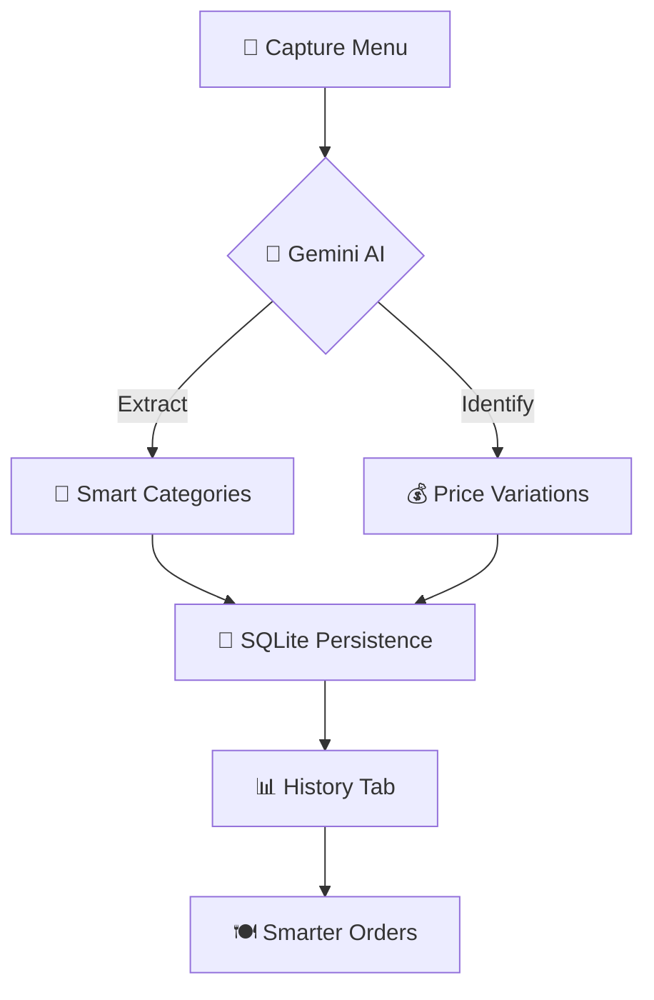

# 🍽️ SnapMenu: Your AI Dining Companion

[](https://flutter.dev)
[](https://ai.google.dev/)
[](https://pub.dev/packages/sqflite)

> **Stop squinting at menus. Start scanning with SnapMenu.**

SnapMenu is not just an app; it's a premium, AI-powered experience that transforms how you look at restaurant menus. Built with the cutting-edge **Gemini 2.5 Flash**, it decodes complexity into simplicity, helping you eat smarter, not harder.

---

## 🧐 The Problem
We've all been there:
- 🖋️ **Illegible handwriting** or cramped fonts on physical menus.
- 💸 **Hidden costs** for different sizes (S/M/L).
- 🤯 **Menu fatigue** when trying to find something within a specific budget.

## ✨ The Magic (Key Features)

### 🧠 Gemini AI Powered
Our brain is powered by Google's latest **Gemini 2.5 Flash** model. It doesn't just "see" text; it *understands* the menu structure, identifying categories, descriptions, and complex price variations instantly.

### 💰 Smart Budgeting
Tell SnapMenu your budget, and it will highlight exactly what you can afford. It even accounts for different sizes and portions!

### 📂 Infinite History
Every scan is a memory. Locally persisted using **SQLite**, your scans are saved with their original images and decoded data. Access them anywhere, anytime—even offline.

### 🎨 Premium Aesthetics
A dark-themed, glassmorphic UI designed for the modern user. Smooth micro-animations (powered by `flutter_animate`) and elegant **Poppins** typography make every interaction feel like a luxury.

---

## �️ How it Works (The Visual Flow)



---

## �🛠️ The Engine Room (Tech Stack)

| Component | Technology |
| :--- | :--- |
| **Frontend** | Flutter (Dart VM) |
| **Logic** | Gemini 2.5 Flash API |
| **Storage** | SQLite + SharedPreferences |
| **Design** | Custom Vanilla CSS-inspired Theme |
| **Animations** | Flutter Animate |

---

## 🚀 Getting Started

1. **Clone the magic:**
   ```bash
   git clone https://github.com/SHahzaibAsif/SnapMenu.git
   ```
2. **Fuel the AI:**
   Add your Gemini API key in `lib/services/gemini_service.dart`.
3. **Ignition:**
   ```bash
   flutter run
   ```

---

## 👤 Author

**SHahzaibAsif**
*Visionary Developer & UI enthusiast*

[](https://github.com/SHahzaibAsif)

---
*Created with 💖 and Artificial Intelligence.*
